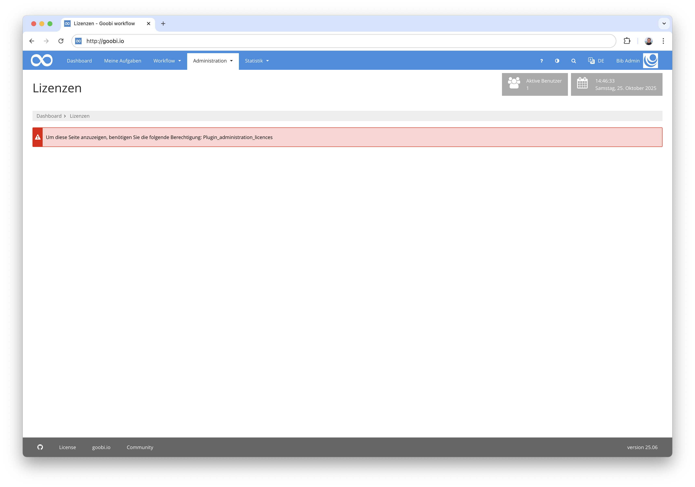
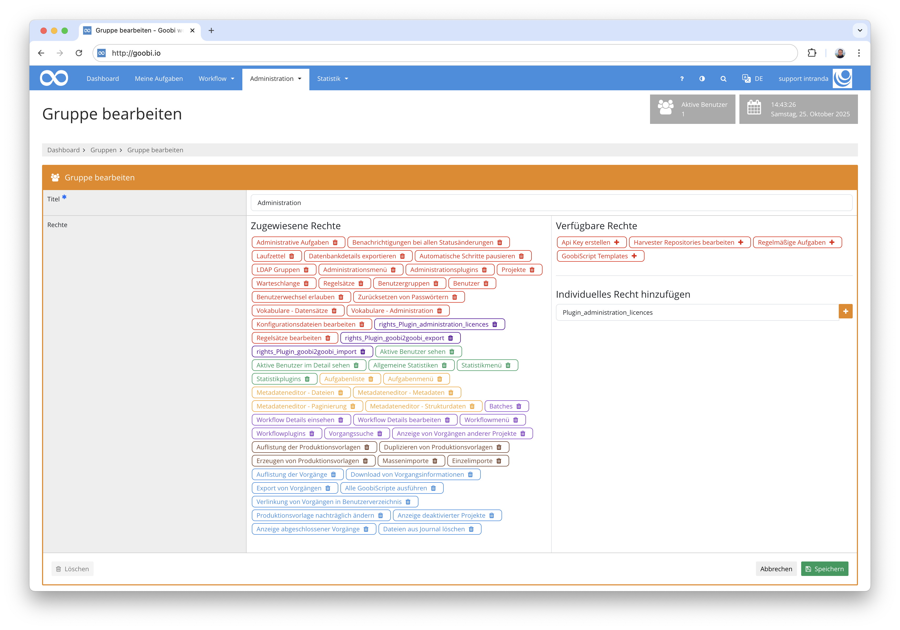
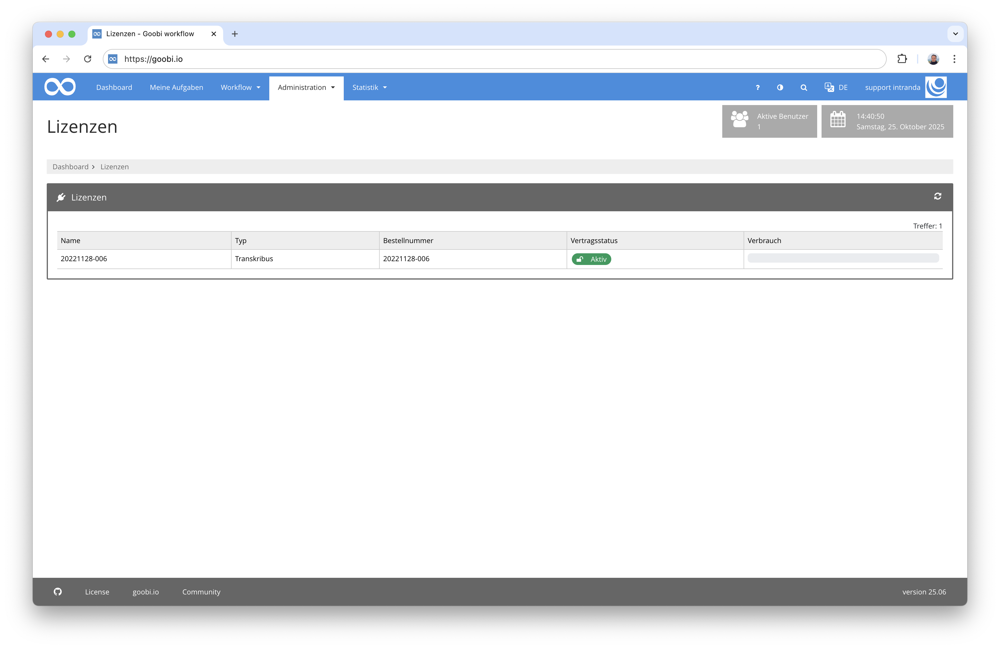

## Einführung
Die vorliegende Dokumentation beschreibt die Installation, die Konfiguration und den Einsatz des Administration Plugins für den Einblick in den Status der verschiedener Lizenzen für OCR-Kontingente bei intranda.


## Installation
Um das Plugin nutzen zu können, müssen folgende Dateien installiert werden:

```bash
/opt/digiverso/goobi/plugins/administration/plugin-administration-licences-base.jar
/opt/digiverso/goobi/plugins/GUI/plugin-administration-licences-gui.jar
```

Für eine Nutzung dieses Plugins muss der Nutzer über die korrekte Rollenberechtigung verfügen.



Bitte weisen Sie daher der Gruppe die Rolle `Plugin_administration_licences` zu.




## Überblick und Funktionsweise
Wenn das Plugin korrekt installiert und konfiguriert wurde, ist es innerhalb des Menüpunkts `Administration` zu finden.



Hier wird nun tabellarisch der Umfang des Seitenkontingents sowie dessen tatsächlicher aktueller Verbrauch aufgelistet.

## Konfiguration
Die Konfiguration des Plugins erfolgt in der Datei `plugin_intranda_administration_licences.xml` wie hier aufgezeigt:

{{CONFIG_CONTENT}}

Die folgende Tabelle enthält eine Zusammenstellung der Parameter und ihrer Beschreibungen:

Parameter               | Erläuterung
------------------------|------------------------------------------------------
`url`                   | Die URL REST-API des Lizenzservers von intranda
`login`                 | Nutzername für den Lizenzserver von intranda
`password`              | Passwort für den Lizenzserver von intranda

