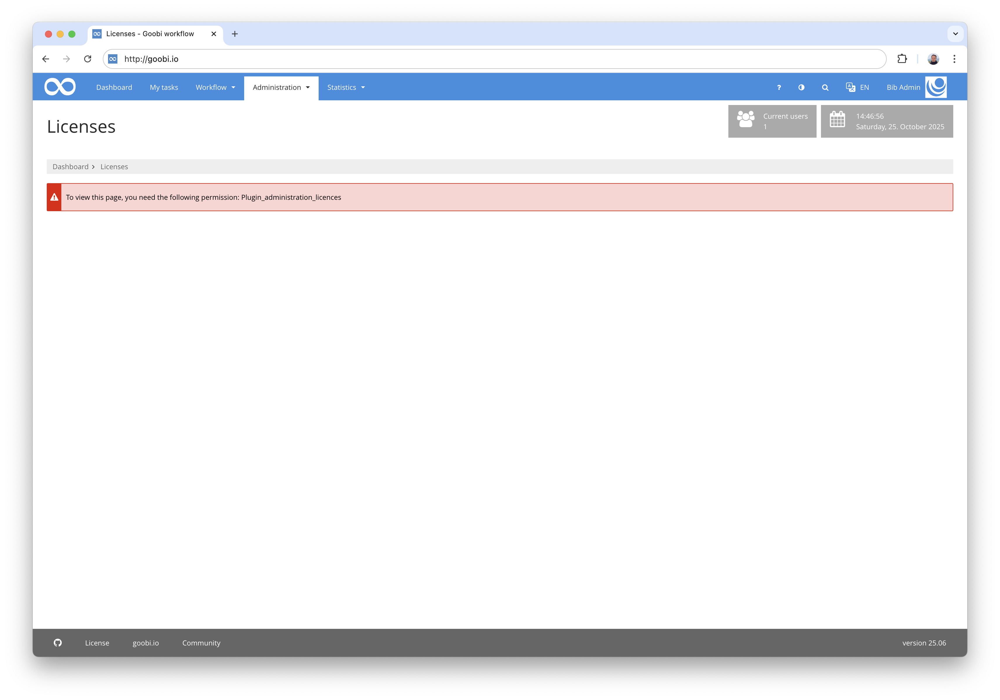
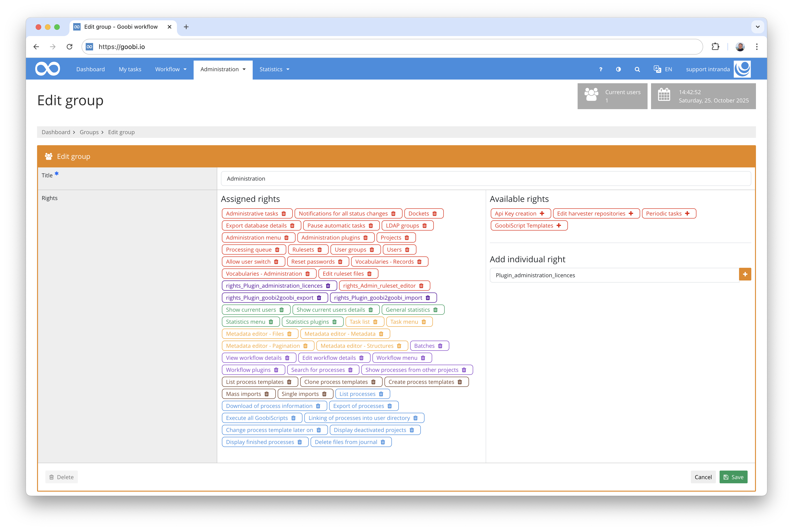
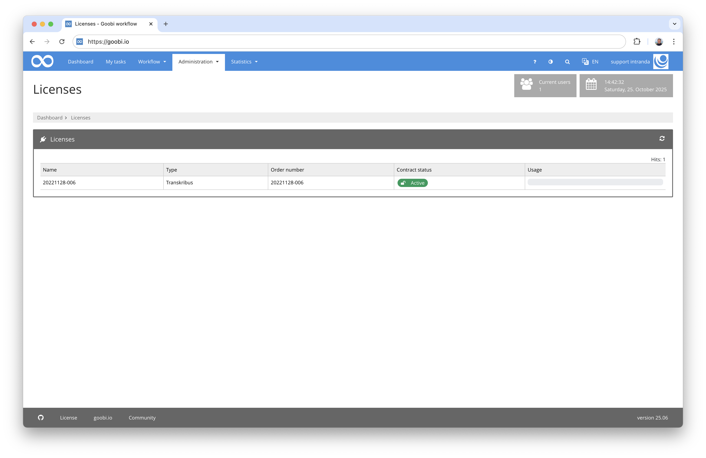

## Introduction
This documentation describes the installation, configuration and use of the administration plugin for viewing the status of various licences for OCR quotas at intranda.


## Installation
To use the plugin, the following files must be installed:

```bash
/opt/digiverso/goobi/plugins/administration/plugin-administration-licences-base.jar
/opt/digiverso/goobi/plugins/GUI/plugin-administration-licences-gui.jar
```

To use this plugin, the user must have the correct role authorisation.



Therefore, please assign the role `Plugin_administration_licences` to the group.




## Overview and functionality
Once the plugin has been correctly installed and configured, it can be found under the Administration menu item.



The scope of the page quota and its actual current usage are now listed in a table.

## Configuration
The plugin is configured in the file `plugin_intranda_administration_licences.xml` as shown here:

{{CONFIG_CONTENT}}

The following table contains a summary of the parameters and their descriptions:

Parameter               | Explanation
------------------------|------------------------------------------------------
`url`                   | The URL REST API of the intranda licence server
`login`                 | Username for the intranda licence server
`password`              | Password for the intranda licence server

